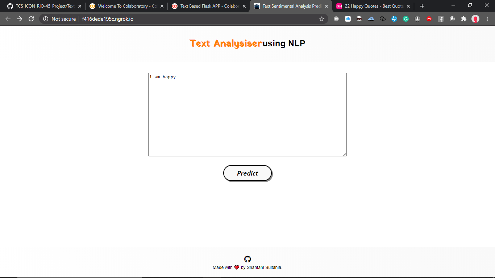

# TCS_ICON_RIO-45_Project

This is my final project for TCS ION RIO-45 

## About Project 

In this project I have Build various Application for Getting feedback from the user.

The 3 main Features are :

1) Twitter Based Sentimental Analysis

2) Text based Sentimental Analysis

3) Movie based Genre Analysis

# Demo:

A Demo OF all the 3 features is Given Below.

## Home page 

 

 

## Twitter Based Sentimnetal Analysis 

 

 

## Text based Sentimental Analysis
 

 

## Movie based Genre Analysis

 

 

# Developing Environment 

## Python 

For downloading python just go to https://www.python.org/ and click download click or you can use this link this will download the latest version of python for you https://www.python.org/ftp/python/3.8.2/python-3.8.2.exe

after that a .exe file will be downloaded just go through it and "Eureka" you Python is installed

## IDE 

As a developer, I prefer any one of these IDE for the same Pycharm and Anaconda You can use any one of the same.

### Pycharm

To install Pycharm 

just go through this link and do the needful installation you can also refer to this video tutorial given below for reference 

https://www.jetbrains.com/pycharm/download/
[Video reference](https://www.youtube.com/watch?v=AUiM1UaRCPc) 

### Anaconda 

To install Anaconda

just go through this link and do the needful installation you can also refer to this video tutorial given below for reference 
https://docs.anaconda.com/anaconda/install/windows/

[Video for reference](https://www.youtube.com/watch?v=T3ff57rxTa8)

### Made with ❤️ by Shantam Sultania

#### About me

I am an Andriod developer, Actions on Google, Internet of things, Alexa Skills, and Image processing developer.
I have a keen interest in Image processing and Andriod development.
I am Currently Campus Representative at Google developers Group Chandigarh, Facebook Developer circle Chandigarh, and Club Lead at CSE Department Chandigarh University, Punjab.

You can find me at:-
[Linkedin](https://www.linkedin.com/in/shantam-sultania-737084175/) or [Github](https://github.com/shantamsultania) .

Happy coding ❤️ .

